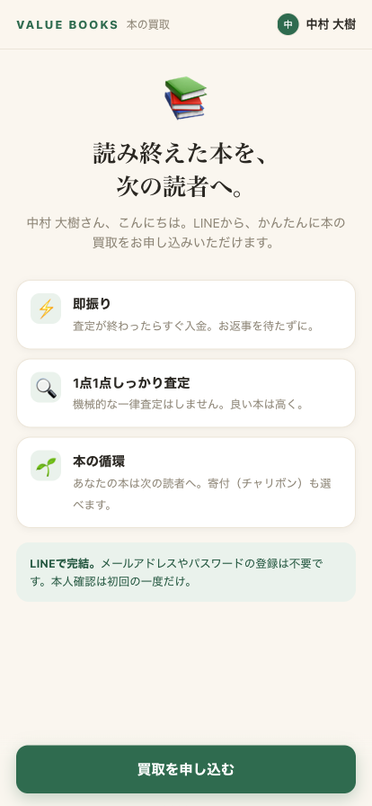
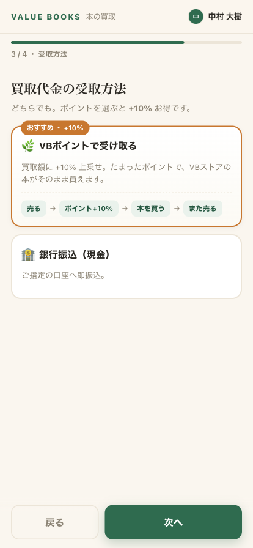
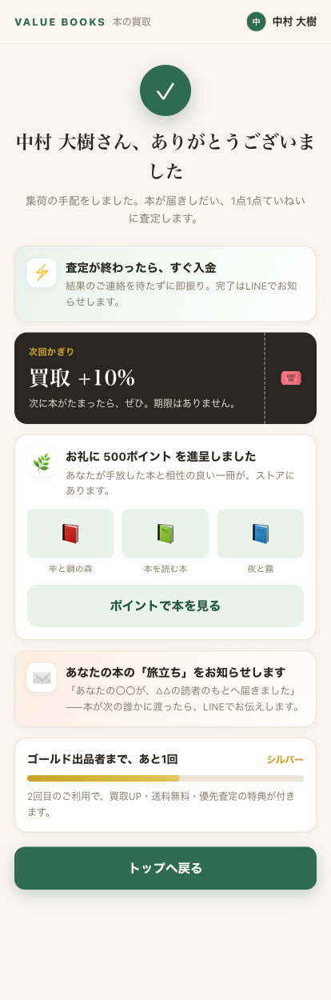

# LIFF 買取サイト（プロトタイプ）

LINE（LIFF）上で、本の買取申込を最後まで完結させる UI プロトタイプ。
広告 → LINE → 申込（本人確認まで）→ 完了画面でのリピート喚起、までを通しで体験できる。

| ① ウェルカム | ② 受取方法 | ③ 完了 |
|---|---|---|
|  |  |  |

## これは何 / これは何でない
- **これは**：UX・フロー・リテンション設計を検証するための動くモック（HTML / CSS / vanilla JS + LIFF SDK）
- **これでない**：本番実装。本番は **Next.js + TypeScript + Auth.js(LINE Provider) + LIFF + 買取API（Cloud Run / PostgreSQL）** を想定

## ローカルで動かす
```bash
python3 -m http.server 8777
# → http://localhost:8777/index.html
# LINE外（ブラウザ）ではモックのプロフィールで全画面を確認できる
```

## 画面フロー
1. **ウェルカム** — LINEプロフィール挨拶 / サービスの約束 / 「メール・パスワード登録は不要」を明記
2. **本の情報** — 冊数・ジャンル・箱数（箱がない → 集荷キット送付）
3. **集荷** — 郵便番号→住所・希望日
4. **受取方法** — 現金（銀行振込）or ポイント受取（+10%）
5. **本人確認 / eKYC** — 書類＋顔写真。**初回のみ**（2回目以降はスキップ）
6. **確認 → 送信**
7. **完了** — 即振り予告 / 次回オファー / ポイント付与＋レコメンド / 通知予告 / ステータス

## 認証・ID 設計
- 認証は **LINE Login のみ**（メール / パスワード不要）。`liff.getProfile()` の `userId` を取得
- **マスターは自社の `customer_id`**、`line_user_id` を紐付け（`app.js` の `resolveCustomer()` 参照、本番は API）
- 既存サイトのログインも LINE Login に統一可能（既存会員は初回のみリンク作業）
- スキーマに **`line_user_id` / `auth_provider`** を最初から持たせる前提

## 本番化のステップ
1. LINE Developers で **LIFFアプリ作成** → `app.js` の `LIFF_ID` を設定、必要なら `email` scope を申請
2. **eKYC ベンダー連携**（例：TRUSTDOCK 等／古物営業法の非対面本人確認に対応するもの）を本人確認ステップへ
3. **買取 API** を実装し、`app.js` の `submit()`（`POST /api/buyback/applications`）に接続
4. 既存の買取システムへは **API 境界経由**で連携（直接 DB 書き込みはしない）
5. 完了後の **Push Message**（次回オファー／周期リエンゲージ等）を Messaging API で実装
6. HTTPS 配信（Vercel or Cloud Run）→ LIFF エンドポイントに登録

## 想定 API
| 機能 | エンドポイント | 備考 |
|---|---|---|
| 顧客解決 | `POST /api/customers/resolve` | lineUserId → customerId, isReturning, kycDone |
| 申込 | `POST /api/buyback/applications` | 申込本体 |
| eKYC | ベンダーSDK + `POST /api/kyc` | 初回のみ |
| ポイント | `POST /api/points/grant` | ポイント台帳 |
| 通知 | Messaging API (push) | リテンション通知 |

## ファイル
- `index.html` — 全画面
- `styles.css` — スタイル（モバイル前提）
- `app.js` — LIFF初期化（mockフォールバック）・画面遷移・送信・完了組み立て
- `screenshots/` — 画面キャプチャ
